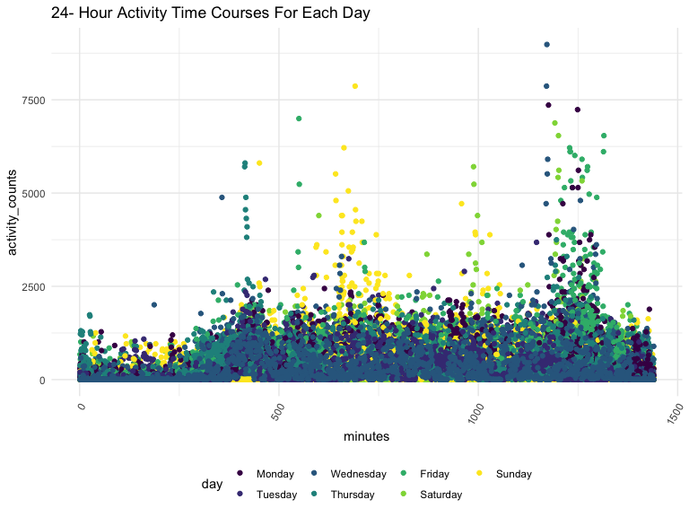
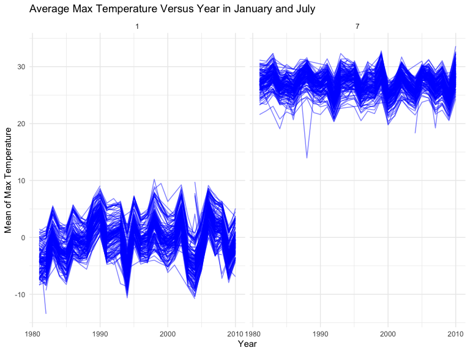
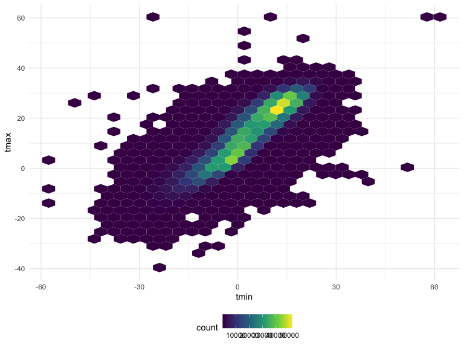
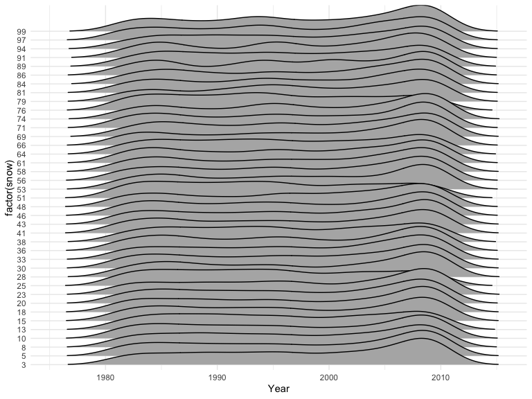
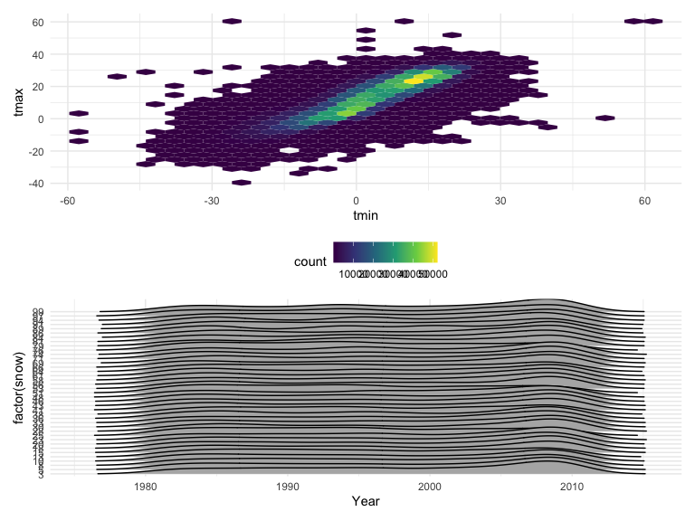

p8105_hw3_ver2117
================
Varvy Rousseau
2022-10-12

\#Loading necessary packages

``` r
library(tidyverse)
```

    ## ── Attaching packages ─────────────────────────────────────── tidyverse 1.3.2 ──
    ## ✔ ggplot2 3.3.6      ✔ purrr   0.3.4 
    ## ✔ tibble  3.1.8      ✔ dplyr   1.0.10
    ## ✔ tidyr   1.2.0      ✔ stringr 1.4.1 
    ## ✔ readr   2.1.2      ✔ forcats 0.5.2 
    ## ── Conflicts ────────────────────────────────────────── tidyverse_conflicts() ──
    ## ✖ dplyr::filter() masks stats::filter()
    ## ✖ dplyr::lag()    masks stats::lag()

``` r
library(knitr)
library(patchwork)
library(ggridges)

  opts_chunk$set(
    echo = TRUE,
    warning = FALSE,
    fig.width = 8, 
  fig.height = 6,
  out.width = "90%")

theme_set(theme_minimal() + theme(legend.position = "bottom"))

options(
  ggplot2.continuous.colour = "viridis",
  ggplot2.continuous.fill = "viridis")

scale_colour_discrete = scale_colour_viridis_d
scale_fill_discrete = scale_fill_viridis_d
```

\#Problem 2 \#Loading,tidying, and wrangling the accel data

``` r
accel_df = read.csv("accel_data.csv") %>%
  janitor::clean_names() %>%
  pivot_longer(
  activity_1:activity_1440,
  names_to = "minutes",
  names_prefix = "activity_",
  values_to = "activity_counts") %>% 
  mutate(
    minutes = as.numeric(minutes),
    day = factor(day),
    day = factor(day, levels = c("Monday", "Tuesday", "Wednesday", "Thursday", "Friday", "Saturday", "Sunday")),
    weeknd_vs_weekday = as.numeric(day %in% c("Saturday", "Sunday")),
    weeknd_vs_weekday = recode(weeknd_vs_weekday, '1'="Weekend", '0'="Weekday"))

head(accel_df)
```

    ## # A tibble: 6 × 6
    ##    week day_id day    minutes activity_counts weeknd_vs_weekday
    ##   <int>  <int> <fct>    <dbl>           <dbl> <chr>            
    ## 1     1      1 Friday       1            88.4 Weekday          
    ## 2     1      1 Friday       2            82.2 Weekday          
    ## 3     1      1 Friday       3            64.4 Weekday          
    ## 4     1      1 Friday       4            70.0 Weekday          
    ## 5     1      1 Friday       5            75.0 Weekday          
    ## 6     1      1 Friday       6            66.3 Weekday

``` r
nrow(accel_df)
```

    ## [1] 50400

``` r
ncol(accel_df)
```

    ## [1] 6

\#Describe the variables, how many observations???, etc.. The
accelerometer dataset is composed of 63 year-old males with a BMI of 25
that were admitted to the Advanced Cardiac Care Center of Columbia
University Medical center and diagnosed with congestive heart failure
(CHF).

The number of observations(50400) in tidied dataset is 50400. The
variables in this dataset include week, day, minutes, activity counts,
and an added variables weekend versus weekday variable.

# Create a table showing these totals

\#Aggregate across mins for each day & table

``` r
total_act = accel_df %>% 
 janitor::clean_names() %>%
 group_by(day, week)%>%
 summarize(total_sum = sum(activity_counts))%>%
  pivot_wider(
    names_from = "day",
    values_from = "total_sum")
```

    ## `summarise()` has grouped output by 'day'. You can override using the `.groups`
    ## argument.

``` r
total_act
```

    ## # A tibble: 5 × 8
    ##    week  Monday Tuesday Wednesday Thursday  Friday Saturday Sunday
    ##   <int>   <dbl>   <dbl>     <dbl>    <dbl>   <dbl>    <dbl>  <dbl>
    ## 1     1  78828. 307094.   340115.  355924. 480543.   376254 631105
    ## 2     2 295431  423245    440962   474048  568839    607175 422018
    ## 3     3 685910  381507    468869   371230  467420    382928 467052
    ## 4     4 409450  319568    434460   340291  154049      1440 260617
    ## 5     5 389080  367824    445366   549658  620860      1440 138421

\#Look at the trends When looking at the table, the activity totals for
weeks 1, 2, and 5 all of the activity totals increase from Monday to
Friday and Monday to Saturday for week 2. For the other weeks the
activity totals decrease from Monday to Friday. For weeks 4 and 5 the
total for Saturday is 1440.

\#Single Panel Plot

``` r
ggplot(accel_df, aes(x = minutes, y = activity_counts)) +
         geom_point(aes(color = day)) +
  labs(title = "24- Hour Activity Time Courses For Each Day ") +
  theme(axis.text.x = element_text(angle = 60, hjust = 1))
```


\# Describe any patterns that I see Overall the graph is a bit messy but
you can see that Sunday, Saturday, Thursday and Tuesday have some high
activity counts.

\#Problem 3 \#Loading the Data & relevant packages

``` r
library(p8105.datasets)

data("ny_noaa") 
```

\#Cleaning the data

``` r
ny_noaa_t = 
  ny_noaa %>%
  separate(date, into = c("Year", "Month", "Day"), convert = TRUE) %>%
  mutate(
    tmax = as.numeric(tmax),
    tmin = as.numeric(tmin),
    tmax = tmax / 10, 
    tmin = tmin / 10,
    prcp = prcp / 10)

# Getting a mode of snow

ny_snowfall = 
  ny_noaa_t %>%
  count(snow) %>%
  arrange(desc(n))
```

For snowfall the most commonly observed value is 0 which would mean that
it was probably not snowing for those days.

\#Making the two panel plot showing the average max temperature in
January and July in each station across years \#Plot for January & July

``` r
ny_noaa_t %>%
  group_by(Month, Year, id) %>%
  filter(
    Month %in% c("1", "7")) %>%
      summarise(
        tmax_mean = mean(tmax, na.rm = TRUE)) %>%
      ggplot(aes(x = Year, y = tmax_mean, group = id)) +
      labs(
        x = "Year",
        y = "Mean of Max Temperature",
        title = "Average Max Temperature Versus Year in January and July") +
      geom_line(alpha = 0.5, color = "blue") + facet_grid(~ Month) 
```

    ## `summarise()` has grouped output by 'Month', 'Year'. You can override using the
    ## `.groups` argument.



``` r
t_max_out = 
  ny_noaa_t %>%
  group_by(Month, Year, id) %>%
  filter(
    Month %in% c("1", "7")) %>%
      summarise(
        tmax_mean = mean(tmax, na.rm = TRUE)) 
```

    ## `summarise()` has grouped output by 'Month', 'Year'. You can override using the
    ## `.groups` argument.

``` r
summary(pull(t_max_out, tmax_mean))
```

    ##    Min. 1st Qu.  Median    Mean 3rd Qu.    Max.    NA's 
    ## -13.439  -0.217   8.635  13.312  27.003  33.600    5970

Yes you can see the average maximum temperature is higher in July than
in January. Yes there are some outliers. In the January graph has an
outlier of -13.439 and on the July graph there is an outlier of 33.600

\#Making tmax vs tmin for the full dataset (note that a scatterplot may
not be the best option); and (ii) make a plot showing the distribution
of snowfall values greater than 0 and less than 100 separately by year.

``` r
yr_plot = 
  ny_noaa_t %>%
      ggplot(aes(x = tmin, y = tmax)) +
      geom_hex()
      labs(
        x = "Tmin",
        y = "Tmax",
        title = "Tmin Versus Tmax for NY_NOAA Dataset") +
        theme(axis.text.x = element_text(angle = 90, vjust = 0.5, hjust=1))
```

    ## NULL

``` r
yr_plot
```



``` r
sno_fall = 
  ny_noaa_t %>%
  filter(snow > 0 & snow < 100) %>%
  ggplot(aes(x = Year, y = factor(snow))) +
  geom_density_ridges(scale = 3, rel_min_height = 0.01) +
  scale_fill_viridis_c(name = "Snowfall", option = "A")
  labs(
    x = "Year",
    y = "Snowfall",
    title = "Snowfall")
```

    ## $x
    ## [1] "Year"
    ## 
    ## $y
    ## [1] "Snowfall"
    ## 
    ## $title
    ## [1] "Snowfall"
    ## 
    ## attr(,"class")
    ## [1] "labels"

``` r
sno_fall
```

    ## Picking joint bandwidth of 1.9



``` r
yr_plot / sno_fall
```

    ## Picking joint bandwidth of 1.9


